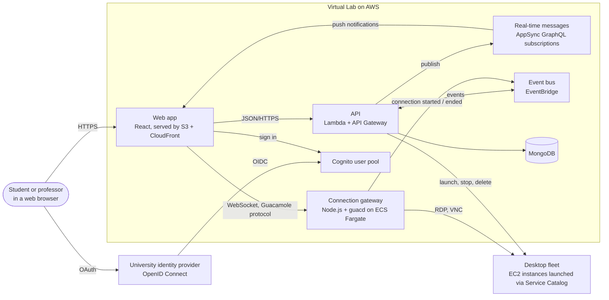

# Virtual Lab

<p align="center">
    <a href="https://codecov.io/gh/obf-software/virtual-lab-core/graph/badge.svg?token=H8923AGEJG">
        
    </a>
    <a href="http://creativecommons.org/licenses/by/4.0/">
        
    </a>
</p>

Virtual Lab is a cloud-hosted virtual desktop platform for universities. A professor prepares a desktop template with the operating system and software a course or research group needs. Students and researchers then launch their own copies of that desktop on AWS and use them from any device with a web browser, with nothing to install. Desktops shut themselves down when nobody is connected, so the university pays only for the hours actually used.

This repository is the full source code of my undergraduate final project (Trabalho de Conclusão de Curso, or TCC) in Information Systems at the Federal University of Technology, Paraná (UTFPR).

## Table of contents

- [Why this exists](#why-this-exists)
- [The final paper](#the-final-paper)
- [How it works](#how-it-works)
- [Key concepts](#key-concepts)
- [Architecture](#architecture)
- [Technologies](#technologies)
- [Repository layout](#repository-layout)
- [Running and deploying](#running-and-deploying)
- [What it costs to run](#what-it-costs-to-run)
- [Limitations and future work](#limitations-and-future-work)
- [License](#license)

## Why this exists

Public universities in Brazil buy computers through slow, bureaucratic public bidding processes. By the time a lab is equipped, the hardware is often already behind what research and coursework demand. On the other side, a large share of students come from low-income families and do not own a computer capable of running the software their courses require. During the COVID-19 pandemic, when campus labs closed, both problems became impossible to ignore.

Virtual Lab turns the powerful machine into a service instead of a purchase. The computing power lives in the public cloud, is billed by the hour, and is reachable through a browser from a cheap laptop, a tablet, or a library terminal. The university stops managing hardware depreciation and gets a single web interface to control who can use what.

## The final paper

The project was written up as a monograph in Portuguese:

> **Sistema baseado em infraestrutura de desktops virtuais em nuvem pública para ensino e pesquisa**
> (_A system based on public cloud virtual desktop infrastructure for education and research_)
>
> Otávio Baziewicz Filho, advised by Prof. Me. Wilson Horstmeyer Bogado.
> Bachelor of Information Systems, Federal University of Technology, Paraná (UTFPR), Curitiba campus, 2024.

The LaTeX source, bibliography, and diagrams live in the [`final-paper`](https://github.com/worgho2/utfpr/tree/main/final-paper) folder of my [`utfpr`](https://github.com/worgho2/utfpr) repository, which collects the coursework from my degree. The paper covers the literature review, the requirements, the architecture, the implementation, screenshots of the running system, and the cost analysis in more depth than this README.

## How it works

Imagine a digital image processing course. The professor, who has been given the **administrator** role in Virtual Lab, opens the web app and creates an **instance template** called "Image Processing 2024". A template fixes the operating system image and the disk size. The professor can build one from an official Linux or Windows image, or take one of their own running desktops with all the software already installed and turn that into a template.

A student, who is a **regular user**, signs in with their university account. They pick the "Image Processing 2024" template, give their new desktop a name, and choose a **hardware type**, meaning a virtual machine size in CPU and memory, from the list the administrator allowed them to use. Behind the scenes, Virtual Lab asks AWS to create a virtual machine from the template, configures it, and pushes progress notifications to the student's browser as it goes. The student never has to refresh the page.

When the desktop is ready, the student clicks **Connect**. The browser opens a remote desktop session through the **connection gateway**, a service that translates between the browser and the virtual machine's native remote desktop protocol: Remote Desktop Protocol (RDP) for Windows, Virtual Network Computing (VNC) for Linux. The browser only ever carries an encrypted connection token. The desktop's password lives in AWS Systems Manager Parameter Store, is read by the API when it builds the token, and is unwrapped only inside the gateway. Files the student saves stay on the desktop's disk between sessions.

When the student closes the tab, the gateway tells the rest of the system the connection ended. Virtual Lab schedules a shutdown of that desktop. If the student reconnects before the timer fires, the shutdown is cancelled. If they do not, the machine powers off and stops costing money. The student can turn it back on, reboot it, or delete it any time from the instance list.

Three roles cover everyone who touches the system:

| Role              | What they can do                                                                                                                                                                                                                                                                  |
| ----------------- | --------------------------------------------------------------------------------------------------------------------------------------------------------------------------------------------------------------------------------------------------------------------------------- |
| **Pending user**  | Has an account but cannot use any resources yet. Every self-registered account starts here until an administrator approves it.                                                                                                                                                    |
| **Regular user**  | Launches desktops from existing templates, manages their own desktops, connects to them. Bound by quotas: how many desktops, which hardware types, and whether they may enable hibernation, which saves the desktop's memory to disk on shutdown so it resumes where it left off. |
| **Administrator** | Everything a regular user can do, plus creating and editing templates, approving users, changing roles, and adjusting quotas.                                                                                                                                                     |

Sign-in works with an email and password, or through the university's own identity provider if one is configured at deploy time. Self-registration can be switched off for deployments that only want institutional accounts.

## Key concepts

**Cloud computing and Infrastructure as a Service.** Instead of owning servers, you rent computing capacity from a provider and pay for what you use. Virtual Lab runs entirely on Amazon Web Services (AWS) and treats each student desktop as a rented resource with a clear start and stop.

**Virtual Desktop Infrastructure (VDI).** A VDI hosts desktop environments on servers and streams them to users on demand. The user's device only draws the screen and sends keyboard and mouse input. Virtual Lab is a VDI where the servers are AWS virtual machines and the client is a web page.

**Virtualization.** One physical machine is sliced into many isolated virtual machines, each with its own operating system. This is what lets a cloud provider sell computing by the hour and what lets Virtual Lab create and destroy desktops in minutes.

**Templates and instances.** A template is a recipe: operating system image plus disk size. An instance is a concrete desktop cooked from that recipe with a chosen hardware type. Many instances can come from one template, and an administrator can turn a customized instance back into a new template.

**Idle detection through the gateway.** Instead of guessing idleness from CPU metrics, Virtual Lab treats a desktop as in use only while a browser session is open through its own connection gateway. Connection start and end events drive the automatic shutdown scheduling.

**Hexagonal architecture (ports and adapters).** The API's business rules are written as use cases that depend only on interfaces, called ports. Concrete implementations, called adapters, plug into those ports: one adapter talks to MongoDB, another to Cognito, another to EC2. For unit tests, in-memory adapters replace the real ones, so every use case is tested without touching AWS or a database.

**Infrastructure as Code.** Every cloud resource the system needs is declared in TypeScript and created by a single deploy command. A new university can stand up its own complete copy of Virtual Lab in a fresh AWS account without clicking through the AWS console.

**C4 model.** A way of drawing software architecture at zooming levels of detail: system context, containers, and components. The paper documents Virtual Lab at all three. The diagram below is the container level, where each box is a separately running piece.

## Architecture



The system has five parts that carry project code. The remaining boxes in the diagram are managed AWS services they rely on.

- **Web app.** The interface for every role: instance list, template management, user administration, profile and quotas, notifications, and the in-browser remote desktop screen. Built with React and Chakra UI, published as a static site.
- **API.** All business rules. Runs as AWS Lambda functions behind API Gateway, organized in four modules: users, instances, instance templates, and miscellaneous (hardware types and recommended OS images). Also hosts the event handlers that react to desktop state changes and connection events, and the scheduled jobs.
- **Connection gateway.** A WebSocket server bundled in a Docker container with `guacd`, the Apache Guacamole daemon. The browser speaks the Guacamole protocol to the gateway. The gateway speaks RDP or VNC to the desktop. Connection tokens are encrypted with AES-256 by the API and decrypted by the gateway, so the browser never sees desktop credentials. Runs on ECS Fargate behind an Application Load Balancer and scales horizontally with demand.
- **Real-time messaging.** An AppSync GraphQL API that the web app subscribes to. Each user can subscribe only to their own channel. The API publishes instance state changes and launch progress there.
- **Documentation site.** A Docusaurus site with a user guide, a technical reference, and the interactive OpenAPI specification of the API, generated automatically when the infrastructure is synthesized.

Desktops themselves are EC2 instances. Their lifecycle (instance, security group, disk, IAM role) is packaged as AWS Service Catalog products, one for Linux and one for Windows, each with a first-boot script that prepares the remote desktop server. EventBridge carries operational events between components and provides the scheduler used for automatic shutdowns. Cognito holds credentials and the optional OpenID Connect link to the university's identity provider, so the application database stores only non-sensitive operational data.

## Technologies

| Area                   | Technology                                                                                         |
| ---------------------- | -------------------------------------------------------------------------------------------------- |
| Language and runtime   | TypeScript on Node.js 18                                                                           |
| Infrastructure as Code | SST 2 on top of AWS CDK 2                                                                          |
| API                    | AWS Lambda, API Gateway, Middy middleware, Zod validation, Lambda Powertools logging               |
| Data                   | MongoDB (MongoDB Atlas in the reference deployment), using the official Node.js driver             |
| Web app                | React 18, Vite, Chakra UI, TanStack Query and Table, React Hook Form, Zustand, AWS Amplify         |
| Remote desktop         | Apache Guacamole 1.5.3 (`guacd` daemon, protocol, and a customized JavaScript client), RDP and VNC |
| Connection gateway     | Node.js WebSocket server, Docker, supervisord, ECS Fargate, Application Load Balancer              |
| Real-time              | AWS AppSync with GraphQL subscriptions and VTL resolvers                                           |
| Events and scheduling  | AWS EventBridge, EventBridge Scheduler, SNS                                                        |
| Desktop provisioning   | AWS EC2, Service Catalog, CloudFormation, Systems Manager Parameter Store                          |
| Identity               | AWS Cognito with optional OIDC identity provider                                                   |
| Static hosting         | AWS S3 and CloudFront, optional custom domains via Certificate Manager                             |
| Documentation          | Docusaurus 3, Stoplight Elements, OpenAPI 3                                                        |
| Quality                | Jest with in-memory MongoDB, ESLint, Prettier, GitHub Actions CI, Codecov                          |
| Observability          | CloudWatch, optional New Relic Lambda instrumentation                                              |

The paper explains the choice of each tool. In short: UTFPR already runs on AWS, SST gives a local development loop that runs Lambda code against real cloud resources, and Guacamole is a mature open-source remote desktop stack whose daemon and protocol could be reused without adopting its web application and its own user model.

## Repository layout

```
.
├── packages/
│   ├── api/                 Business rules and all backend entry points
│   │   ├── application/     Use cases and the ports they depend on
│   │   ├── domain/          Entities, DTOs, application events
│   │   ├── infrastructure/  Adapters: MongoDB, Cognito, EC2, EventBridge, in-memory test doubles
│   │   └── interfaces/      HTTP handlers, event consumers, scheduled jobs
│   ├── app-sync-api/        GraphQL schema and resolvers for real-time messages
│   ├── client/              React web app
│   ├── connection-gateway/  WebSocket gateway container with guacd
│   └── docs/                Docusaurus documentation site
├── stacks/                  Infrastructure as Code (one CloudFormation stack per file)
│   ├── products/            Service Catalog products for Linux and Windows desktops
│   ├── scripts/             First-boot scripts that prepare each desktop
│   └── config/              Feature flag parsing
├── __tests__/               Jest lifecycle (in-memory MongoDB setup and teardown)
├── .github/workflows/       CI: typecheck, lint, format check, tests with coverage
├── sst.config.ts            Wires the stacks together
└── .env.example             Every deploy-time feature flag with its default
```

## Running and deploying

The complete guide lives in the documentation package under `packages/docs/docs/technical-reference`. The short version:

Prerequisites are Node.js 18 (see `.nvmrc`), Docker, the AWS CLI with a profile named `virtual-lab`, and a MongoDB database you can reach from AWS, for example a free MongoDB Atlas cluster. Even local development runs against real AWS resources for your own stage, so an AWS account is required.

```bash
npm install                      # installs every package, including the client and docs
cp .env.example .env             # adjust feature flags as needed

npm run dev                      # API and infrastructure in SST live-development mode
cd packages/client && npm run dev             # web app
cd packages/connection-gateway && npm run dev # gateway container
cd packages/docs && npm run dev               # documentation site
```

The first run of `npm run dev` or of a deploy creates a Parameter Store entry for the MongoDB URL of that stage, initially set to a placeholder. Paste your connection string there and the API will pick it up. To deploy to an AWS account:

```bash
npm run deploy -- --stage production
```

Feature flags in `.env` control self-registration, the external identity provider, custom domains for the web app and docs, log format, whether the Cognito user pool survives a teardown, and New Relic instrumentation. Each one is documented in the docs package.

Quality checks run on every push:

```bash
npm run dev:check   # typecheck, lint, test, format
```

## What it costs to run

The paper estimates two scenarios with the AWS pricing calculator at 2024 prices. Both cover AWS services only. The MongoDB Atlas database is billed separately and is not included.

| Scenario                                                                                | Monthly cost |
| --------------------------------------------------------------------------------------- | ------------ |
| Term time: 100 desktops of type `t3.micro`, used 1.5 hours per day, 5 days a week       | USD 289.82   |
| Recess: no desktops, only the always-on parts (gateway cluster, load balancer, storage) | USD 35.13    |

At full use, the desktops themselves are the bulk of the bill. At rest, the connection gateway and its load balancer are almost all of it.

## Limitations and future work

The remote desktop protocols exchange a lot of data between browser and gateway, so the experience depends directly on the quality of the user's internet connection.

Directions the paper suggests for future work:

- A network proxy between the desktops and the internet to apply the same security filtering and traffic monitoring the university network uses.
- Session sharing between users, which the Guacamole protocol already supports.
- A shared network file system across desktops with per-user isolation.
- Resizing the hardware of an existing desktop (disk, memory, CPU) without recreating it.
- Integration with distance learning platforms such as Moodle.

## License

The code in this repository is released under the [Creative Commons Attribution 4.0 International](LICENSE) license.
